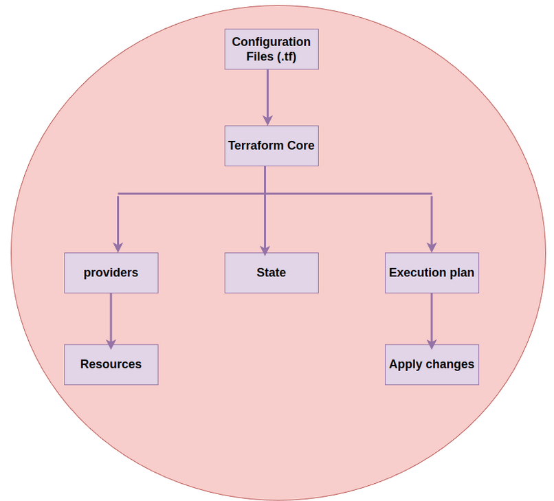

### **2. Terraform Architecture**

#### **A- Basic Questions:**

**1- What are the components of Terraform architecture?**

- Terraform's architecture is composed of several core components that work together to provision, manage, and maintain infrastructure in a declarative way. Here are the main components in this Diagram:

  - Diagram of Terraform Architecture Components

  

***

**2- What is the Terraform Core, and what are its primary responsibilities?**

- Terraform Core, together with providers and modules, makes Terraform a powerful tool for managing complex infrastructures consistently and declaratively. Terraform Core’s have many Key Responsibilities : 

  - **Parse configurations** (HCL/JSON files). We can also use some languages like : Python and typescript

  - **Build the dependency graph** (DAG) for resources.

  __Example__ : command to see the graph of resources : terraform graph

  - **Generate and display the execution plan** for changes.

  - **Apply resource changes** through providers.

  - **Manage the state** to track infrastructure resources.

  - **Communicate with providers** to interact with infrastructure platforms.

***

**3- What is a Terraform provider?**

- A **Terraform provider** is a plugin that allows Terraform to interact with external services, APIs, and platforms, enabling it to manage resources on these services. Providers encapsulate the details of how to connect to these external services and define the types of resources that can be managed within Terraform. Each provider is tailored to a specific platform, like AWS, Azure, Google Cloud, Kubernetes, Docker, etc. A Terraform provider enables Terraform to manage resources across diverse platforms by:

  - Authenticating with the platform.

  - Defining available resources and data sources.

  - Translating Terraform configurations into API calls.

  - Managing the resource lifecycle on the specified platform.

***


#### **B- Intermediate Questions:**

**4- Define Resource Graph in Terraform.**

- In Terraform, a **Resource Graph** is a directed acyclic graph (DAG) that represents the relationships and dependencies between resources in an infrastructure configuration.

- The resource graph enables Terraform to:

  - **Determine Dependency Order**: Identify the order in which resources must be provisioned or modified. Resources that depend on others will be created only after their dependencies are fully configured.

  - **Parallel Execution**: Execute independent resources in parallel to improve provisioning speed. For example, if a virtual machine and a database have no dependency on each other, Terraform can create them concurrently.

  - **Dependency Tracking**: Track complex dependencies across multiple resources and modules, allowing Terraform to resolve dependencies automatically when changes are made.
  - ```terraform graph ```
  - or ```terraform graph > graph.dot```

***

**5- Explain the role of Terraform providers in resource provisioning.**

-  The role of Terraform providers in resource provisioning is essential for:

  - Enabling **platform-specific resource creation and management**.

  - Securing and managing **authentication**.

  - Controlling the **resource lifecycle** for each platform.

  - Supporting **data sources** to query existing infrastructure.

  - Managing **dependencies** and **resource linkage** across complex configurations.

***

**6- Describe the purpose of Terraform’s version constraints in module declarations.**

- Terraform’s version constraints in module declarations provide:

  - **Controlled versioning for compatibility** and stability.
  - **Protection against breaking changes**.
  - **Consistency and reproducibility** across deployments.

***


#### **C- Advanced Questions:**

**7- How does Terraform handle the provider lifecycle, and how can providers be extended?**

- Terraform handles the provider lifecycle by managing the installation, initialization, configuration, and interaction of providers during each stage of its workflow. Providers are essential plugins that allow Terraform to interact with different infrastructure services (e.g., AWS, Azure, Kubernetes), and Terraform manages them automatically to ensure they are available and properly configured when needed. Terraform handles the provider lifecycle by:

  - Installing providers with terraform init.
  - Initializing providers for secure connectivity.
  - Configuring provider settings in .tf files.
  - Managing execution by facilitating resource operations via API calls.

***

**8- What is the process for creating custom Terraform providers?**

- To create a custom Terraform provider:
  - Set up the development environment using Go and the Terraform Plugin SDK.
  - Define provider configuration and connection settings.
  - Implement resources and CRUD operations for managing resources.
  - Compile, test, document, and, optionally, publish the provider.

***

**9- How does we ensure state consistency across multiple cloud environments?**

- We ensures state consistency across multiple cloud environments by:

  - **Centralizing state in remote backends** for a single source of truth.

  - **Enabling state locking** to prevent simultaneous modifications.

  - **Using environment-specific state files or workspaces** to isolate state by environment.

  - **Refreshing state and validating plans** to minimize drift.

- These mechanisms allow Terraform to manage and maintain reliable, consistent infrastructure across complex multi-environment setups, enabling teams to work with confidence across distributed and diverse cloud environments.
